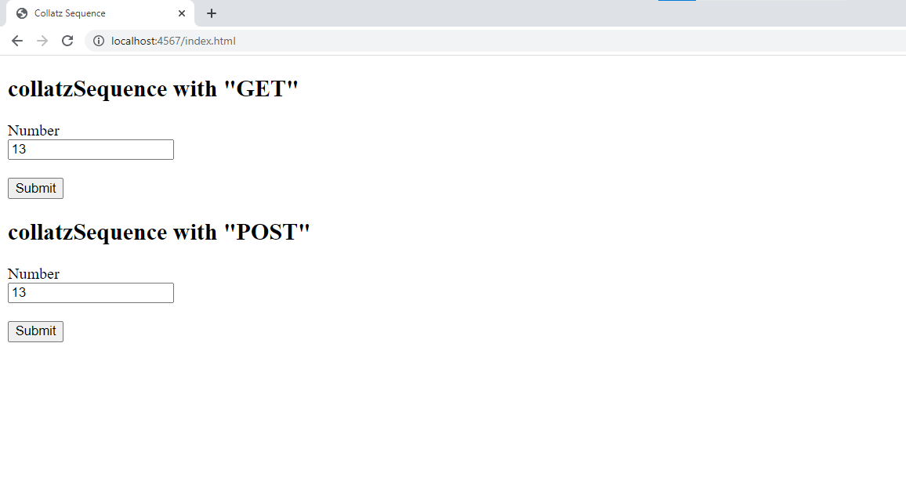
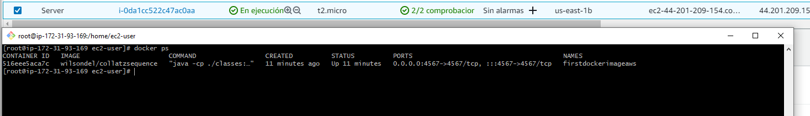
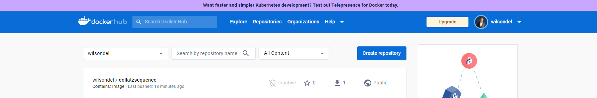
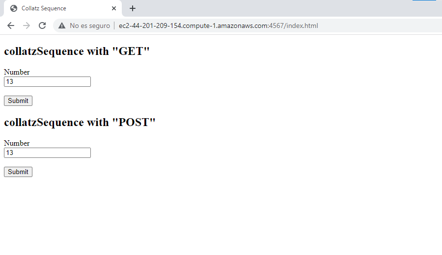
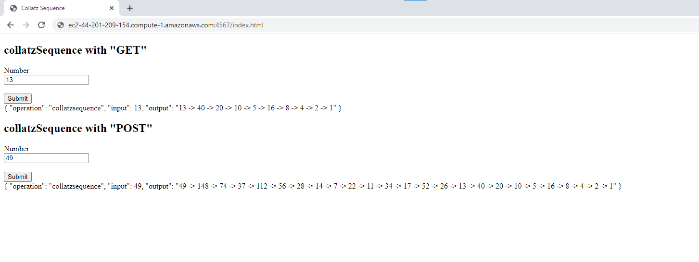
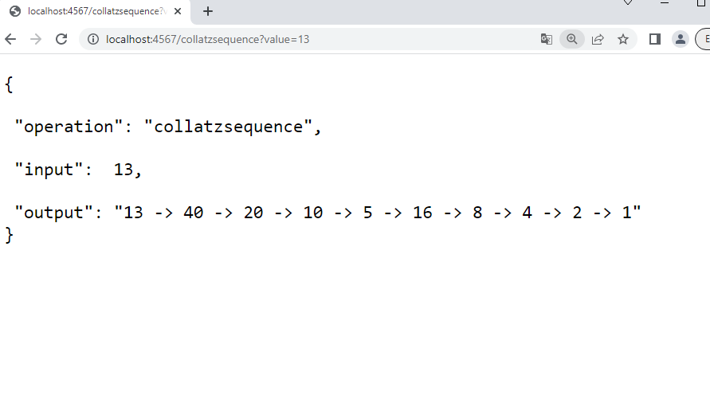
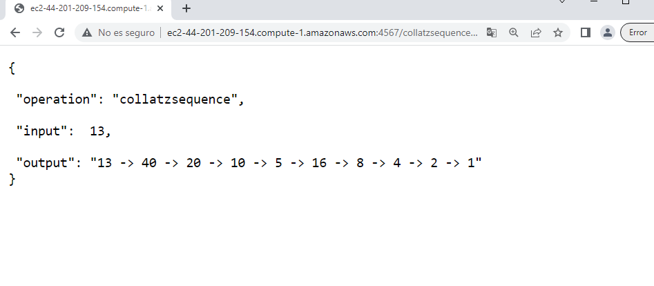
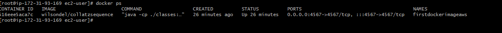
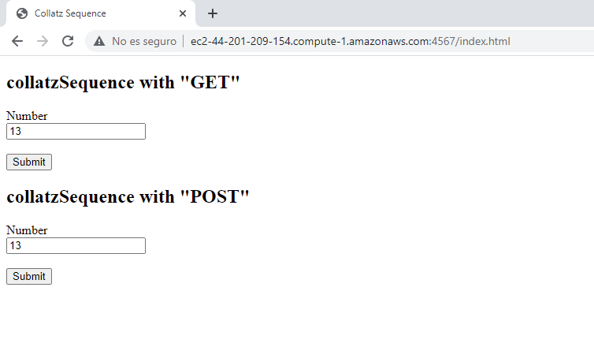

# Parcial 2 AREP


**Nombre** : Wilson Alirio Delgado Hernández


## Instrucciones para correrlo

Puede clonar el proyecto con 

```
git clone https://github.com/wilsondel/arep_parcial_2.git
```

Puede compilar el proyecto con


```
mvn clean install
```

Y posteriormente ejecutarlo con:

En windows:

```
java -cp "target/classes;target/dependency/*" org.example.RestService
```

En Linux:

```
java -cp "target/classes:target/dependency/*" org.example.RestService
```

O puede crear la imagen y desplegar un contenedor con:

```
docker build --tag dockersparkprimer .
docker run -d -p 4567:4567 --name firstdockercontainer dockersparkprimer
```

Luego, puede acceder a la ruta: 

http://localhost:4567/index.html




## Evidencia funcionamiento

La instancia ec2 y corriendo el contenedor docker:




Imagen en docker hub:



https://hub.docker.com/u/wilsondel


Accediendo a http://ec2-44-201-209-154.compute-1.amazonaws.com:4567/index.html se tiene:



Probando los diferentes servicios:




Ejemplo de llamado desde URL en local:




Ejemplo de llamado desde URL en aws:




## Correrlo en EC2
En la carpeta awsKey se encuentra la llave para realizar la conexión a la instancia de ec2, se usa el comando:


```
ssh -i "server.pem" ec2-user@ec2-44-201-209-154.compute-1.amazonaws.com
```

Se realiza la instalación y el levantamiento del servicio Docker:

```
sudo yum update -y
sudo yum install docker
sudo service docker start
docker run -d -p 4567:4567 --name firstdockerimageaws wilsondel/collatzsequence
```




De esta forma, se puede acceder a Ahora se puede acceder a http://ec2-44-201-209-154.compute-1.amazonaws.com:4567/index.html :





